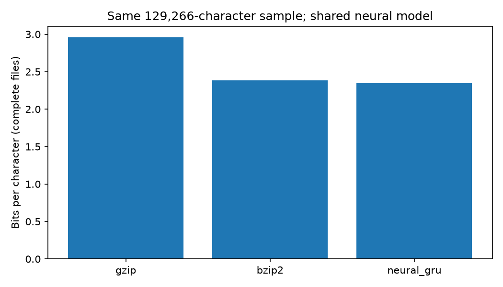

# Neural Text Compressor

Lossless text compression with a small character-level language model and an
arithmetic coder written from scratch. The model predicts the next character,
the arithmetic coder turns those predictions into bits. The better the
predictions, the smaller the file.

The project compares this against gzip and bzip2 and checks Shannon's source
coding theorem in practice: the compressed size should be almost exactly the
model's cross-entropy on the text.

The full report with the theory and discussion is in [writeup.md](writeup.md).

## Results

Trained on three Project Gutenberg books (*Pride and Prejudice*,
*Frankenstein*, *Alice's Adventures in Wonderland*, 1,292,652 characters,
97 distinct characters). The last 10% of each book is held out for
validation. All three methods compress the same 129,270 validation
characters, and all three decompress to exactly the original bytes.

| Method | Compressed size (bytes) | Bits per character |
|---|---:|---:|
| gzip (level 9) | 50,415 | 3.120 |
| bzip2 (level 9) | 41,573 | 2.573 |
| **Neural (GRU + arithmetic coding)** | **29,729** | **1.840** |

The neural compressor produces files 41% smaller than gzip and 28% smaller
than bzip2 on this text.




**Shannon's theorem in practice.** The information content of the sample under
the model (the sum of -log2 p over every character, using the exact
probabilities the coder sees) is 235,755.6 bits. The arithmetic coder
produced 235,760 bits, only 4 bits more for the whole sample.
The remaining 259 bytes of the file are the header and checksums.

**Caveats**

- The model (about 334k parameters, 1.3 MB) is not counted in the file size.
  That is the usual setup when both sides already share the model. Counting
  it would make a file this size much bigger than gzip's output.
- The same split was used to pick the best epoch, so it is not a fully
  untouched test set.
- Speed: a few thousand characters per second in pure Python, compared to
  milliseconds for gzip and bzip2.

## Same model on other texts

How much does the result depend on the training data? The same model
compresses 50,000 characters from five texts, ordered from close to far
from the training books (`experiments/ood_generalization.py`).

| Text | gzip | bzip2 | Neural | Model only | Unknown characters |
|---|---:|---:|---:|---:|---:|
| Held-out part of the training books | 3.183 | 2.664 | **1.735** | 1.694 | 0 |
| *Sense and Sensibility* (unseen Austen book) | 3.081 | 2.619 | **1.900** | 1.857 | 1 |
| Modern English (Wikipedia) | 2.935 | **2.580** | 4.531 | 3.331 | 592 |
| German (Kafka, *Die Verwandlung*) | 3.253 | **2.748** | 9.299 | 6.266 | 1,120 |
| Python code (`argparse.py`) | 1.769 | **1.586** | 7.090 | 3.868 | 1,688 |

All values in bits per character. "Model only" is the cost of the model's
predictions, without the unknown characters stored in the header.


- gzip and bzip2 stay between 2.6 and 3.3 bits/char on every prose text
  (code is easier for them because it repeats a lot). The neural
  compressor goes from 1.74 to 9.30.
- On an unseen book by the same author it only gets 0.17 bits/char worse
  and still beats bzip2 clearly, so the model learned the style and not
  just the three books.
- On modern English the model alone already needs 3.33 bits/char, worse
  than bzip2 before any unknown characters are counted.
- On German the model needs 6.27 bits/char. Guessing uniformly among the 97
  characters would cost log2(97) = 6.6 bits, so the model has almost
  nothing to go on.
- The loss has two separate causes. The model's predictions don't fit the
  text ("Model only"), and characters outside the 97-character vocabulary
  (ä, ö, ü, ß, ", =, # and so on) cost 12 to 17 bytes each in the header,
  which adds 1.2 to 3.2 bits/char. A byte-level vocabulary would remove the
  second problem but not the first.

The compression rate is a property of the text *and* the model: the
same text is cheap for a model that expects it and expensive for one that
doesn't.

The Wikipedia text is from the article "Large language model"
([CC BY-SA 4.0](https://creativecommons.org/licenses/by-sa/4.0/)).

## How it works

1. **Model** (`src/model.py`): embedding (128), 1-layer GRU (256), linear
   layer, trained with cross-entropy on sequences of 128 characters
   (`src/train.py`). Cross-entropy in nats divided by ln 2 gives the model's
   estimate of bits per character.
2. **Arithmetic coder** (`src/arithmetic_coder.py`): 32-bit integer
   implementation following Witten, Neal and Cleary (1987), with its own
   self-tests on fixed distributions.
3. **Connecting the two** (`src/lm_coder.py`): at each step the GRU's
   softmax output is rounded to integer frequencies summing to 65,536
   (every character gets at least 1) and passed to the coder. The decoder
   runs the exact same steps, so it rebuilds the same table before
   decoding each character.
4. **File format** (`src/file_format.py`): small header plus SHA-256
   checksums, so a wrong model or a damaged file gives an error instead of
   wrong text. Details are in [docs/FORMAT.md](docs/FORMAT.md).

## Running it

Python 3.10 or newer. From the repository root:

```powershell
python -m venv .venv
.venv\Scripts\Activate.ps1        # macOS/Linux: source .venv/bin/activate
python -m pip install -r requirements.txt
```

Full pipeline:

```powershell
python src/download.py            # download the three books
python src/tokenizer.py           # clean them, build the corpus, train/val split and vocabulary
python src/baseline.py            # gzip/bzip2 on the full corpus
python src/train.py               # train, writes checkpoints/char_gru.pt
python src/benchmark.py           # results table and plot above
python experiments/ood_generalization.py   # same model on other kinds of text
```

Tests:

```powershell
python -m unittest discover -s tests -v
python src/arithmetic_coder.py
```

Compress and decompress a file:

```powershell
python src/compress.py --in-path data/corpus.txt --out results/corpus.nlc
python src/decompress.py --in-path results/corpus.nlc --out results/restored.txt --verify-against data/corpus.txt
```

For a quick try on a prefix:

```powershell
python src/compress.py --chars 20000 --out results/prefix.nlc
python src/decompress.py --in-path results/prefix.nlc --verify-against data/corpus.txt --verify-prefix
```

`benchmark.py` also works on any other UTF-8 file:

```powershell
python src/benchmark.py --in-path path/to/text.txt --out-dir results/other
```

A compressed file can only be decoded with the exact checkpoint that
created it. Retraining overwrites `checkpoints/char_gru.pt`, so keep a copy
if you need to read older files.

## Repository layout

```text
neural-compressor/
├── data/                  books, corpus, train.txt, val.txt, vocab.json
├── checkpoints/           trained model
├── docs/FORMAT.md         .nlc file format
├── experiments/           out-of-distribution experiment
├── results/
│   ├── baseline_metrics.json
│   ├── training_log.csv
│   ├── benchmark_table.csv
│   ├── benchmark_metadata.json
│   └── plots/
├── src/
│   ├── download.py
│   ├── tokenizer.py
│   ├── baseline.py
│   ├── model.py
│   ├── train.py
│   ├── arithmetic_coder.py
│   ├── lm_coder.py
│   ├── file_format.py
│   ├── compress.py
│   ├── decompress.py
│   └── benchmark.py
├── tests/test_pipeline.py
├── requirements.txt
└── writeup.md             full report
```
