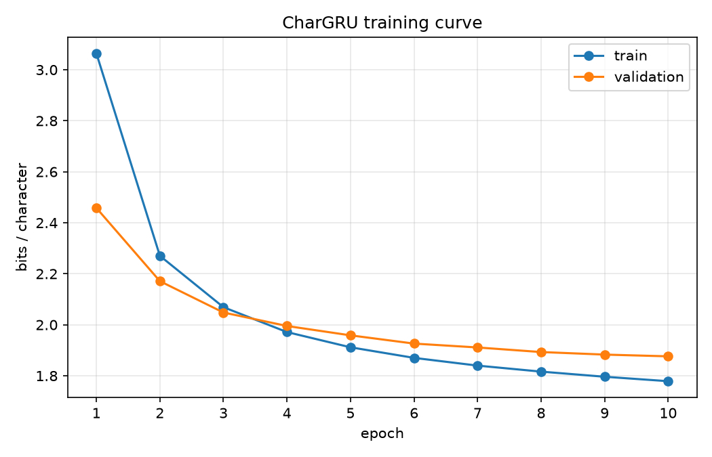
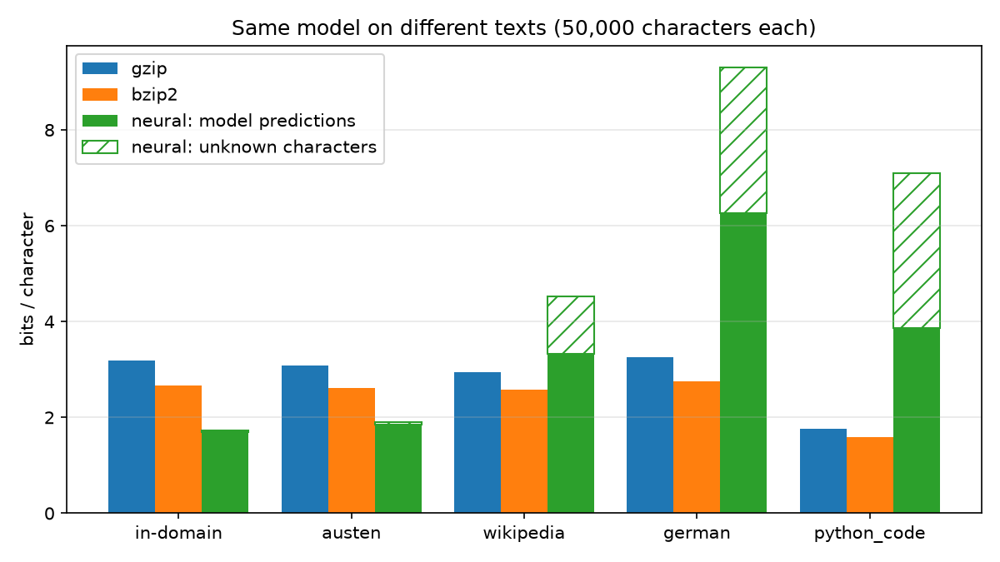

# Neural Text Compression with a Character-Level GRU and Arithmetic Coding

## 1. Introduction

Compression and prediction are closely linked: if you can predict the next
symbol well, you can encode it with few bits. Delétang et al. (2024) use this link at a large scale,
combining large pretrained language models with arithmetic coding to
compress text, images and audio. This project tests the same idea on a
small scale. A small character-level language model predicts the next
character, and an arithmetic coder turns those predictions into a
compressed file. The result is compared against gzip and bzip2, and the
same model is then used on texts that are increasingly different from its
training data.

## 2. Theory

### 2.1 Entropy and the source coding theorem

For a source that emits symbols $x$ with probability $p(x)$, the entropy is

$$H(p) = -\sum_x p(x) \log_2 p(x)$$

Shannon's source coding theorem says that no lossless code can use fewer
than $H(p)$ bits per symbol on average, and that codes exist that get
arbitrarily close to it. Entropy is therefore the lower bound for lossless
compression of that source.

### 2.2 Coding with a model: cross-entropy

In practice, the true distribution $p$ is unknown. A compressor uses a
model $q$ instead. A symbol that the model assigns probability $q(x)$ has
an ideal coding cost of $-\log_2 q(x)$ bits. If the symbols come from $p$,
the expected cost is the cross-entropy:

$$H(p, q) = -\sum_x p(x) \log_2 q(x) = H(p) + D_{KL}(p \,\|\, q)$$

The KL divergence is non-negative, so using $q$ cannot improve on the true
source entropy in expectation. It measures the extra expected bits caused
by model mismatch. When $q = p$, this extra cost is zero.

For text, predictions depend on the preceding characters. The ideal coding
cost of one observed sequence is therefore

$$L = -\sum_{t=1}^{N} \log_2 q(x_t \mid x_{<t})$$

Here, $L/N$ is the model's average log loss on that sequence, measured in
bits per character. The same entropy-plus-KL relationship applies to the
conditional distributions, averaged over contexts from the source.

This distinction matters when comparing English with foreign text: a higher
compression rate can reflect both a different source entropy and a larger
model mismatch. The difference between their measured rates is not itself
a measurement of KL divergence.

### 2.3 Why training loss is a compression rate

The network is trained with cross-entropy loss, which PyTorch computes with
the natural log:

$$\text{loss} = -\frac{1}{N} \sum_t \ln q(x_t \mid x_{<t})$$

Dividing by $\ln 2$ gives bits per character, which is exactly $L/N$ from
above. Minimizing the training loss therefore means minimizing the ideal
code length of the training text. The validation loss estimates how well
the compressor will do on unseen text from the same source.

### 2.4 Arithmetic coding

Arithmetic coding turns predicted probabilities into a bitstream. It starts
with the interval $[0, 1)$. For each character, it divides the current
interval into subintervals proportional to the predicted probabilities and
keeps the one belonging to the actual character.

With exact arithmetic, the final interval has width

$$W = \prod_{t=1}^{N} q(x_t \mid x_{<t}),$$

so its ideal information content is

$$-\log_2 W = -\sum_{t=1}^{N} \log_2 q(x_t \mid x_{<t}) = L.$$

With a suitable termination rule, ideal arithmetic coding can represent the
sequence using fewer than $L + 2$ bits. This is a bound for the ideal code,
excluding file metadata and byte padding.

My implementation uses 32-bit integer arithmetic. The model's probabilities
are first converted into integer frequencies summing to 65,536. The
relevant ideal cost is therefore calculated from these rounded
probabilities, which are the ones the coder actually uses.

The coder repeatedly rescales its interval, emitting bits as they become
determined and handling underflow by deferring bits. This allows it to
process long sequences with fixed-width integers. Finite-precision interval
updates can introduce additional coding redundancy, and packing the final
bitstream into bytes adds up to seven padding bits. Headers and checksums
add separate file-format overhead.

The decoder reconstructs the same frequency table from the characters
already decoded and updates its interval in the same way. Given identical
tables and the stored character count, it recovers the encoded sequence.

## 3. Method

### 3.1 Data

The corpus consists of three Project Gutenberg books: *Pride and
Prejudice*, *Frankenstein* and *Alice's Adventures in Wonderland*. After
removing the Gutenberg header and footer, it has 1,292,652 characters and
97 distinct characters.

The last 10% of each book is held out for validation (129,270 characters);
the rest is used for training (1,163,386 characters). My first version held
out the last 10% of the whole corpus instead. That turned out to be almost
entirely *Alice*, so the "validation" set was really a different book, and
the model barely beat bzip2 (2.35 vs 2.38 bits/char). Splitting per book
fixed this.

### 3.2 Model

An embedding layer (128 dimensions), a single GRU layer (256 hidden units)
and a linear output layer, about 334,000 parameters (1.3 MB). It is trained
on sequences of 128 characters with batch size 64, Adam (learning rate
0.003) and gradient clipping at 1.0, for 10 epochs. The checkpoint with the
lowest validation loss is kept.

### 3.3 Connecting the model and the coder

The model runs one character at a time and keeps its hidden state across
the whole file. At each step:

1. The softmax output is turned into integer frequencies that add up to
   exactly 65,536. Every character gets at least 1, so no character is ever
   impossible to encode. The leftover counts from rounding go to the
   characters with the largest remainders.
2. The arithmetic coder encodes the actual character with these
   frequencies.
3. The character is fed into the model to predict the next one.

The first character uses a uniform distribution because there is no
context yet. The decoder runs exactly the same code, so it builds identical
frequency tables. Both sides run single-threaded on the CPU to avoid
floating-point differences.

### 3.4 Unknown characters and file format

The vocabulary is fixed after training. Characters outside it are stored
as-is in the file header, and a space is coded in their place. The decoder
puts the original characters back at the end.

The file contains a small JSON header (character count, SHA-256 of the
checkpoint and of the original bytes, unknown characters), the arithmetic
code, and a SHA-256 of the whole file. Decoding stops with an error if the
file is damaged, the wrong model is used, or the decoded text does not
match the original hash. Unit tests cover empty input, different line
endings, non-ASCII characters, damaged files and a wrong checkpoint.

## 4. Results

### 4.1 Compression on held-out text

All three methods compress the same 129,270 validation characters, and all
three decompress to exactly the original bytes.

| Method | Size (bytes) | Bits per character |
|---|---:|---:|
| gzip (level 9) | 50,415 | 3.120 |
| bzip2 (level 9) | 41,573 | 2.573 |
| Neural | 29,729 | 1.840 |

The neural compressor produces files 41% smaller than gzip and 28% smaller
than bzip2.

### 4.2 The source coding theorem in practice

Using the exact integer frequencies the coder received, the ideal code
length of the sample is $\sum_t -\log_2 q(x_t \mid x_{<t}) = 235{,}755.6$
bits. The arithmetic code, including byte padding, is 235,760 bits long,
so the coder adds only 4.4 bits for the whole text. This is within what
section 2.4 predicts: under 2 bits for the ideal code, up to 7 bits of
padding, and a small finite-precision cost. The rest of the file is the
header and checksums (259 bytes, 0.016 bits/char).

The coded cost (1.824 bits/char) is slightly lower than the best validation
loss (1.876 bits/char). During training the hidden state is reset every
128 characters, while during compression it carries through the whole
file, so the model has more context.

### 4.3 Training

Validation loss decreases in every epoch, from 2.46 to 1.88 bits/char, and
stays close to the training loss (1.78). The model is not overfitting, and
more epochs would probably still help a little.

## 5. Out-of-distribution experiment

The same model compresses 50,000 characters from five texts, ordered from
close to far from the training data.

| Text | gzip | bzip2 | Neural | Model only | Unknown chars |
|---|---:|---:|---:|---:|---:|
| Held-out training books | 3.183 | 2.664 | 1.735 | 1.694 | 0 |
| *Sense and Sensibility* (unseen Austen) | 3.081 | 2.619 | 1.900 | 1.857 | 1 |
| Modern English (Wikipedia) | 2.935 | 2.580 | 4.531 | 3.331 | 592 |
| German (Kafka, *Die Verwandlung*) | 3.253 | 2.748 | 9.299 | 6.266 | 1,120 |
| Python code (`argparse.py`) | 1.769 | 1.586 | 7.090 | 3.868 | 1,688 |

"Model only" is the ideal code length of the model's predictions. The
difference to "Neural" is mostly the unknown characters stored in the
header; the 259-byte header and checksums add another 0.04 bits/char at
this length.

The Wikipedia text is from the article "Large language model"
([CC BY-SA 4.0](https://creativecommons.org/licenses/by-sa/4.0/)).

### 5.1 Interpretation

gzip and bzip2 stay between 2.6 and 3.3 bits/char on every prose text,
while the neural compressor ranges from 1.74 to 9.30. As section 2.2
explains, a higher rate can come from two things: the new text having a
higher entropy, or the model fitting it worse. The measured rates cannot
separate the two. That gzip and bzip2 barely change across the prose texts
suggests that these texts are not much harder to compress in general, so
most of the neural compressor's increase is likely model mismatch. The
same text can be cheap or expensive depending on the model, so a
compression rate always describes the text *and* the model together.

- **Unseen Austen book:** about 0.16 bits/char worse than in-domain and
  still well below bzip2. The model learned 19th-century English prose in
  general, not just the three training books.
- **Modern English:** the model alone needs 3.33 bits/char, already worse
  than bzip2. The vocabulary, sentence structure and topics are different
  enough that the model's knowledge no longer helps.
- **German:** the model needs 6.27 bits/char. Guessing uniformly among the
  97 characters would cost $\log_2 97 = 6.6$ bits, so almost nothing the
  model learned about English carries over. The letter combinations that
  make English predictable are wrong for German.
- **Python code:** gzip and bzip2 do best here, because code repeats
  keywords and names a lot and their dictionary methods find those repeats
  easily. The model has never seen code.

### 5.2 Two kinds of mismatch

The loss has two causes:

1. **Model mismatch:** the predictions do not fit the text (the "Model
   only" column).
2. **Vocabulary mismatch:** characters such as ä, ö, ü, ß, `"`, `=` or `#`
   are not in the 97-character vocabulary. Each one costs 12 to 17 bytes
   in the header, which adds 1.2 to 3.2 bits/char.

The two are not completely separate. Unknown characters are coded as
spaces, which also disturbs the context the model sees, so "Model only" is
somewhat inflated for German and code.

A byte-level vocabulary (256 symbols) would solve the second problem,
since every text can be written in bytes. It would not solve the first
one: the model would still need training data from those domains.

## 6. Limitations

- **Model size:** the 1.3 MB model is not counted in the file size. This
  is fair only if sender and receiver already share the model. Counting
  it, the rate on the validation text would be 84.7 bits/char, far worse
  than gzip. The approach only pays off for large amounts of similar text.
- **Speed:** about 16 seconds each for encoding and decoding 129,270
  characters, compared to milliseconds for gzip and bzip2. The coder is
  written in pure Python and runs the model once per character.
- **Small model and corpus:** a larger model trained on more text would
  predict better and compress better.
- **Character-level:** the model needs one step per character. Subword
  tokens would be faster and usually predict better.
- **Validation set:** the same held-out text was used to pick the best
  epoch and to report the result. Since only the epoch was chosen this
  way, the effect should be small, but it is not a fully untouched test
  set.
- **Reproducibility:** compressed files can only be decoded with the exact
  checkpoint, and floating-point results can differ between machines or
  PyTorch versions. The checksums catch this, but a file compressed on one
  machine is not guaranteed to decode on another.

## 7. Conclusion

A small GRU combined with a from-scratch arithmetic coder compresses
held-out 19th-century English prose to 1.84 bits/char, 28% below bzip2.
The arithmetic coder comes within 4.4 bits of the model's ideal code
length, as the theory predicts. The out-of-distribution experiment shows
the other side of this: the same model is worse than gzip and bzip2 on
modern English, German and code. A neural compressor is only as good as
the match between its model and the data.

## References

- C. E. Shannon, "A Mathematical Theory of Communication," *Bell System
  Technical Journal*, 27, 1948.
- I. H. Witten, R. M. Neal, J. G. Cleary, "Arithmetic Coding for Data
  Compression," *Communications of the ACM*, 30(6), 1987.
- T. M. Cover, J. A. Thomas, *Elements of Information Theory*, 2nd ed.,
  Wiley, 2006.
- G. Delétang et al., "Language Modeling Is Compression," ICLR 2024.